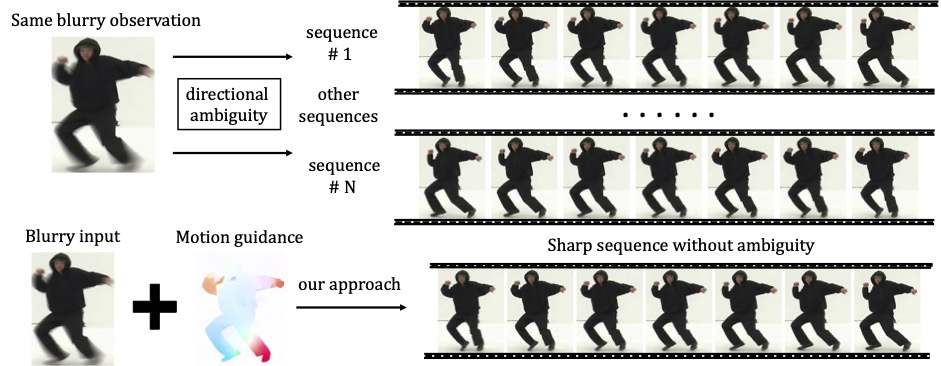
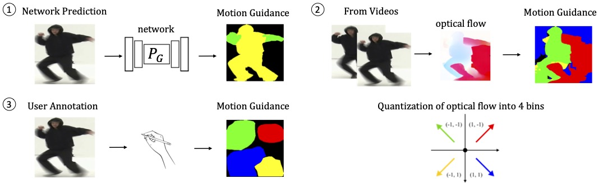

# Animation-from-Blur

#### :rocket: **[ECCV2022]** [Animation from Blur: Multi-modal Blur Decomposition with Motion Guidance](https://arxiv.org/abs/2207.10123)

by [Zhihang Zhong](https://zzh-tech.github.io/), Xiao Sun, Zhirong Wu, Yinqiang Zheng, Stephen Lin, and Imari Sato

:point_right: [Project website](https://zzh-tech.github.io/Animation-from-Blur/), [Video demo](https://drive.google.com/file/d/1ixlU0j-ZnXriVewGe5mQ2pd5mII8d72C/view?usp=sharing)

Please leave a ⭐ if you like this project!

## News

Please check our new work in CVPR 2023, [BiT](https://github.com/zzh-tech/BiT) (Blur Interpolation Transformer), a fast and powerful transformer-based technique for arbitrary factor blur interpolation with state-of-the-art performance.

#### **TL;DR**:

Existing solutions for recovering sharp motion from a single motion-blurred image do not consider the directional
ambiguity for each region. We explicitly account for such directional ambiguity by introducing a motion guidance
representation, which allows us to generate multiple plausible solutions.



The motion guidance representation is a compact quantization of 2D optical flow with only four discrete motion
directions. We propose a unified framework for blur decomposition, which supports various interfaces for generating
motion guidance, including sampling from a prediction network, estimation from neighboring frames, and annotation from
users.



## Preparation

Please download B-AIST++ dataset from this [link](https://drive.google.com/file/d/1Zt96gFnpPpuIqeD3QGPlW6fXhkogjuy_/view?usp=sharing) and unzip it under *./dataset/* directory.

Please download checkpoints from this [link](https://drive.google.com/drive/folders/1JlBpYrveC9eN8nw8XIqbj7iq9tesqGu4?usp=sharing) and put them under *./checkpoints/* directory.

#### Installation:

```shell
conda create -n animation-from-blur python=3.8
conda activate animation-from-blur
pip install torch==1.11.0+cu113 torchvision==0.12.0+cu113 torchaudio==0.11.0 --extra-index-url https://download.pytorch.org/whl/cu113
pip install pyyaml tensorboardX scipy easydict scikit-image opencv-python matplotlib albumentations lpips tqdm torchmetrics==0.5.1
```

## Train

Train blur decomposer:
```shell
python -m torch.distributed.launch --nproc_per_node=4 train_mbd.py --config ./configs/mbd_2s_residual.yaml --log_dir ./experiments/baistpp_mbd --verbose
```

[Optional] Train guidance predictor:
```shell
python -m torch.distributed.launch --nproc_per_node=2 train_vaegan.py --config ./configs/cvaegan_gumble_celoss_z4.yaml --log_dir ./experiments/baistpp_cvaegan_gumble_celoss_z4 --verbose
```

## Evaluation

Multi-modal blur decomposition evaluation with guidance predictor:

```shell
CUDA_VISIBLE_DEVICES=0 python -m torch.distributed.launch --nproc_per_node=1 valid_vaegan.py --predictor_resume_dir ./checkpoints/baistpp_cvaegan_gumble_celoss_z4/  --decomposer_resume_dir ./checkpoints/baistpp_mbd_2s_residual --data_dir ./dataset/b-aist++ -ns 1 --verbose
```

(*P.S., we test ns=1, ns=3, or ns=5 in the paper.*)

Blur decomposition evaluation using neighboring frames:

```shell
CUDA_VISIBLE_DEVICES=0 python -m torch.distributed.launch --nproc_per_node=1 valid_video.py --resume_dir=./checkpoints/baistpp_mbd_2s_residual/ --data_dir ./dataset/b-aist++ --verbose
```

## Limitations

The training process of guidance predictor is unstable due to complicated GAN structure as well as limited data. Besides, the use of synthetic data can lead to limited generalization capabilities. However, the core of our work is to provide an unprecedented solution to explicitly address the directional ambiguity in the blur decomposition task. We hope that the decoupling of directional uncertainty from blur into a motion guidance will inspire subsequent research.

## Citation

If you find this repository useful, please consider citing:

```bibtex
@inproceedings{zhong2022animation,
  title={Animation from blur: Multi-modal blur decomposition with motion guidance},
  author={Zhong, Zhihang and Sun, Xiao and Wu, Zhirong and Zheng, Yinqiang and Lin, Stephen and Sato, Imari},
  booktitle={Computer Vision--ECCV 2022: 17th European Conference, Tel Aviv, Israel, October 23--27, 2022, Proceedings, Part XIX},
  pages={599--615},
  year={2022},
  organization={Springer}
}
@inproceedings{zhong2023blur,
  title={Blur Interpolation Transformer for Real-World Motion from Blur},
  author={Zhong, Zhihang and Cao, Mingdeng and Ji, Xiang and Zheng, Yinqiang and Sato, Imari},
  journal={Proceedings of the IEEE/CVF Conference on Computer Vision and Pattern Recognition},
  year={2023}
}
```

## Acknowledgement

We thank the nice works mentioned below:

- The guidance predictor network is based on the VAE-GAN of [BiCycleGAN](https://github.com/junyanz/BicycleGAN).
- The dataset images are partially from [AIST++](https://google.github.io/aistplusplus_dataset/factsfigures.html)
  , [GOPRO](https://seungjunnah.github.io/Datasets/gopro.html)
  , [DVD](https://www.cs.ubc.ca/labs/imager/tr/2017/DeepVideoDeblurring/)
  and [Dual-Reversed-RS](https://github.com/zzh-tech/Dual-Reversed-RS).
- We use [MMPose](https://github.com/open-mmlab/mmpose) and [RAFT](https://github.com/princeton-vl/RAFT) to preprocess
  the data.
- We use [lableme](https://github.com/wkentaro/labelme) to generate user guidance.
